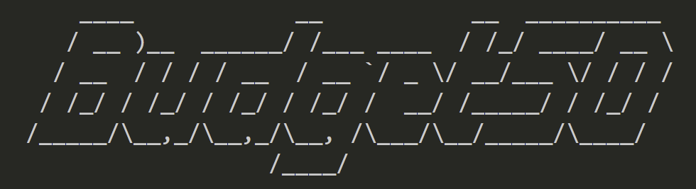

# Budget50


Budget50 is a Python program designed to help users manage their finances by providing various budgeting tools. It allows you to:
- Calculate your paycheck distribution using the 50/30/20 rule.
- Estimate the time required to achieve long-term savings goals.
- View and update your asset amounts.
- Visualize your monthly expenses with a pie chart.

The program includes functionality to interactively update your asset data and visualize your monthly spending, ensuring you have a comprehensive understanding of your finances.

## Features
### Paycheck Calculator:
- Calculates the distribution of your paycheck based on the 50/30/20 rule (50% needs, 30% wants, 20% savings).
- Provides a breakdown of income after taxes, needs, wants, and savings.

### Long-Term Savings Calculator:
- Estimates how long it will take to save up for a specific savings goal based on your monthly deposits.

### Assets Management:
- View current asset amounts from a CSV file.
Update asset values interactively and save changes back to the CSV file.

### Expense Visualizer:
- Allows you to enter and confirm monthly expenses, including subscriptions and additional costs.
- Generates a pie chart to visualize the distribution of your expenses.

## Requirements
While requirements are listed out in `requirements.txt`, here's an overview of all the required libraries. Use pip to install.

```
Python 3.x
pyfiglet -> library for generating styled text
matplotlib -> library for plotting charts
pandas -> library for handling CSV files
csv -> library for reading and writing CSV files
pytest -> Testing python programs
```

## Error Handling
- `FileNotFoundError`: Automatically creates a new CSV file with default asset values.
- `ZeroDivisionError`: Raised in the longTermGoal function if the monthly deposit is zero.
- `ValueError`: Raised for invalid menu options or input errors.
